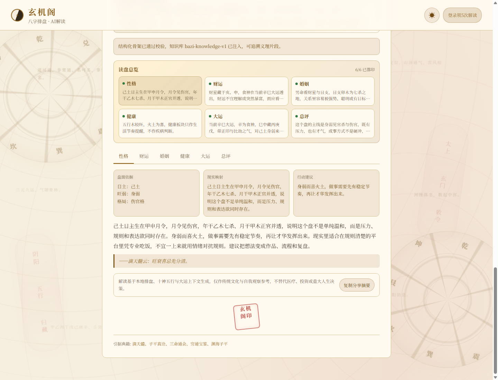

# 玄机阁 · AI 八字排盘命盘咨询 Demo

> 天文历法精确排盘 + DeepSeek 大模型流式解读 + LangGraph 多轮追问的命理 Web 应用
> 一个"计算与生成分离"并带 Agentic RAG 可信引用闭环的 AI First 小型全栈 Demo

**在线 Demo**：部署后建议绑定域名并启用 HTTPS，例如 `https://your-domain.com`


## 功能特性

- **精确排盘**：基于寿星天文历（sxtwl），公历转农历、节气换月令精确到分钟，四柱/十神/五行/神煞/大运全量计算
- **命盘咨询 UI**：首页按“左侧建盘/历史、中间追问咨询间、底部咨询说明”重排，让用户先进入可追问体验，而不是看到工具面板或后台指标
- **AI 流式解读**：DeepSeek V4 Flash 逐字流式输出（SSE），证据驱动 Prompt 要求每个判断回扣月令、十神、藏干、五行、冲合与当前大运
- **多轮追问（Agent）**：看完解读后可对命盘连续追问（LangGraph 工具调用），流年/大运等事实由本地工具实时计算，模型只负责表达；每盘赠 10 炷香火，五位道长按档位消耗 1/2/5 炷，断线重发走幂等回放不重复计香
- **账号体系**：注册/登录，新用户 5 次免费 AI 解读；同一命盘二次查看走缓存，**永远不重复扣费**
- **历史记录**：按账号隔离，访客排过的盘在注册后自动迁移到账号名下；删盘级联清空追问数据（隐私合规）
- **成本可控**：单次解读 token 用量与成本可统计，缓存命中为 ¥0
- **运营统计**：`/api/stats` 默认关闭，配置 `ADMIN_TOKEN` 后可查看账号、缓存、24h AI 成本与注册失败原因
- **零依赖部署**：SQLite 单文件数据库，Docker Compose 一条命令上线




---

## 1. 架构说明

### 1.1 总体架构

```
┌─────────────────────────────────────────────────────┐
│              前端（单页 · 内嵌于 app.py）              │
│   命盘咨询 UI · fetch 读取 SSE 流 · 响应式布局        │
└──────────────────────┬──────────────────────────────┘
                       │ HTTP / SSE
┌──────────────────────▼──────────────────────────────┐
│                 API 层（Flask + Gunicorn/gevent）     │
│  /api/paipan     排盘（纯本地计算，不消耗配额）        │
│  /api/interpret  AI 解读（SSE 流式，消耗配额）         │
│  /api/chat       多轮追问（SSE 流式，LangGraph agent） │
│  /api/chat/quota /api/chat/history   追问额度与会话   │
│  /api/register   /api/login   /api/logout  账号体系   │
│  /api/quota      /api/me     配额与会话查询           │
│  /api/history    /api/history/<id>   历史记录         │
│  /health         /api/stats  健康检查与管理统计         │
└───────┬────────────────────────┬─────────────────────┘
        │                        │
┌───────▼────────┐    ┌──────────▼─────────────────────┐
│   引擎层        │    │            服务层               │
│ bazi_engine.py │    │ db.py（SQLite）                 │
│ · 公历→农历     │    │ · 账号/会话/AI解读配额（5次免费）│
│ · 四柱/十神     │    │ · AI 结果缓存（账号维度隔离）    │
│ · 五行/神煞     │    │ · 历史记录与迁移                │
│ · 大运/起运     │    │ · chat 追问额度/幂等/级联删除   │
│ (sxtwl 天文历)  │    │ ai_service.py（报告链路）       │
│                │    │ chat_tools.py / chat_graph.py   │
│                │    │ · 追问 agent：4 只读工具+图编排  │
└────────────────┘    └──────────┬─────────────────────┘
                                 │ HTTPS (stream=true)
                          ┌──────▼──────┐
                          │ DeepSeek API │
                          │ deepseek-v4-flash │
                          └─────────────┘
```

### 1.2 文件结构

| 文件 | 职责 |
|------|------|
| `app.py` | 主入口：Flask 路由 + 内嵌命盘咨询前端（HTML/CSS/JS 单文件交付） |
| `bazi_engine.py` | 八字排盘核心算法：历法转换、四柱、十神、格局、大运、神煞 |
| `db.py` | SQLite 数据层：账号、会话、配额、缓存、历史、用量日志 |
| `ai_context.py` | 命盘上下文层：把排盘结果整理成稳定 schema，标记当前年龄与当前大运 |
| `bazi_knowledge.py` | 轻量知识库：十神、旺衰、五行偏枯、地支关系和古籍义理白名单 |
| `ai_prompts.py` | Prompt 层：集中管理前置规范、结构化骨架生成和最终正文生成约束 |
| `ai_client.py` | 模型客户端层：DeepSeek/OpenAI 兼容请求、参数校验、流式解析和有限重试 |
| `ai_validator.py` | 质量闸门：检查板块完整性、盘面证据、风险表达和输出长度 |
| `ai_service.py` | AI 编排层：串联 context/prompt/client/validator，处理缓存、成本和 SSE 输出 |
| `chat_tools.py` | 追问 agent 的工具层：流年/大运/古籍检索/临时排盘 4 个只读工具，姓名清洗防注入 |
| `chat_graph.py` | 追问 agent 的图编排：LangGraph 状态图、checkpointer、SSE 事件解析 |
| `classics_search.py` | Agentic RAG 的 R2 检索基线：本地 BM25 + 字元 n-gram，返回可回验 `chunk_id` |
| `data/classics/` | R1 古籍原文 JSONL 语料：7 本、1025 chunks、约 118.6 万字，含来源与版权边界声明 |
| `tools/build_classics_corpus.py` | R1 语料清洗脚本：剥离译文、水印与页码，只保留公版原文段落 |
| `tools/build_classics_index.py` | R2/R3 检索索引 smoke：构建本地索引并查看指定 query 的 top-k 命中 |
| `tools/eval_classics_search.py` | R2 检索评估脚本：20 组固定问题，验证 top-k 命中文献 |
| `tests/` `tools/` | 单元测试与 20 个固定命盘样本预检脚本 |
| `Dockerfile` | 生产镜像（gunicorn + gevent，支持 SSE 长连接） |
| `docker-compose.yml` | 一键部署 + 数据卷持久化 + 健康检查 |

### 1.3 三条核心链路

**排盘链路（免费、无 AI）**

```
用户提交生辰 → 参数校验（含真实日期校验，如 2月30日拒绝）
→ bazi_engine.paipan() 本地确定性计算
→ 结果落库（history 表）→ 返回 JSON（含 history_id，供追问会话定位）
```

**AI 解读链路（消耗配额、SSE 流式）**

```
用户点击"请道长开示" → 校验登录态
→ 查缓存（cache_key = 账号指纹:MD5(prompt版本+模型+生成策略+生辰+性别)）
   ├─ 命中 → 直接流式回放，0 成本 0 配额
   └─ 未命中 → 校验配额 → DeepSeek 流式调用
      → 逐 chunk yield 给前端 → 完成后落缓存
      → 标记历史"已解读" → 扣配额（AI 失败则不扣）
```

**chat 追问链路（每盘 10 炷香火、SSE 流式、LangGraph agent）**

```
用户在结果页追问 → 校验登录态 + 命盘归属（hid 必须属于当前账号）
→ 查幂等表（thread_id = 服务端拼接 账号:hid + 客户端 request_id）
   ├─ 命中 → 免费回放已保存回复，不再扣香火
   └─ 未命中 → 编译对话图 → 按所选道长价格原子扣减香火额度（并发不可能双花）
      → graph.stream(stream_mode="messages") 逐事件转发
      → 模型按需调用只读工具（流年/大运/古籍/临时排盘）
      → 完成后回复落幂等表；AI 异常退款
```

追问链路的几个关键设计：

| 设计 | 目的 |
|------|------|
| 事实走工具，不走记忆 | 模型被禁止自行推算干支；query_liunian 等工具实时调本地引擎，杜绝历法幻觉 |
| thread_id 服务端拼接 | 会话粒度 = 账号指纹:命盘id，客户端无法指定或窥探他人会话 |
| request_id 幂等回放 | 断线重发同一 request_id 只回放已保存回复，不重复计香 |
| 香火原子扣减 + 失败退款 | SQLite 单条 UPDATE 完成检查+扣减，多进程并发不双花；AI 异常自动退回 |
| digest 存独立 state 字段 | 命盘摘要每回合前置进 system prompt，不进会话历史，永不重复、永不乱序 |
| 删盘级联 | 删除历史记录时同步清空追问额度、对话记录与 checkpoint（生辰属敏感个人信息） |
| 流中安全兜底 | 对 `RISKY_PHRASES` 做滑动短句检测，命中后截断危险输出并换安全收尾 |
| 5% 离线抽审 | `tools/audit_chat_replies.py` 稳定抽样已保存回复，本地判官记录 verdict / issue code / 回复哈希 |
| 自动清理 | Docker 默认每日清理 30 天以上 chat checkpoint / 幂等回放 / 观测日志 / 抽审日志，不重置香火额度 |

### 1.4 设计原则：计算与生成分离

八字排盘是**确定性计算**（天文历法 + 固定规则），交由本地引擎完成；
AI 只负责**非确定性的表达**（解读、比喻、古籍引用）。
排盘数据以结构化文本喂给模型，从根本上避免大模型算错历法、编造四柱的幻觉问题。

---

## 2. 关键 Prompt 与 Vibe 思路

### 2.1 System Prompt（现行版本）

```
你是玄机阁的老道长，任务不是泛泛安慰，而是根据给定命盘做具体、克制、有证据的八字解读。
排盘结果已经由本地历法引擎算好，你不得重新排盘、不得改四柱、不得质疑日期，只能依据给定数据分析。
你的口吻要有古典命理味，但要说人话：先抓盘面矛盾，再落到性格、求财、感情、健康、行运上的具体现象。

读盘方法：
1. 每个结论必须能回扣至少两个盘面证据，例如月令、日主强弱、十神、藏干、五行偏枯、地支冲合、当前大运。
2. 身旺喜克泄耗，身弱喜生扶；不要只背规则，要说清楚为什么这个盘如此取用。
3. 财运要区分财星是否透出、是否有根、是否为喜忌、适合稳定收入还是项目经营，不许只写"财运不错"。
4. 婚姻男命重点看财星与日支，女命重点看官杀与日支，同时看冲合刑害；要讲相处模式，不作绝对断语。
5. 健康只做养生提醒，不作疾病诊断；五行偏旺偏弱要落到作息、饮食、压力管理等可执行建议。
6. 大运必须先分析标记为当前大运的那一步，再顺带看未来2-3步，不得把未来大运说成当下。

质量要求：
1. 每个板块采用"盘面抓手 → 现实映射 → 建议提醒"的结构，但不要写成列表。
2. 多用具体场景和动作，例如"适合在规则清楚的平台里凭专业吃饭"，少用空词，例如"比较顺利""贵人相助"。
3. 可以直言短板，但要留改运空间；避免恐吓、宿命化、医疗/投资/婚姻绝对建议。

格式要求：
1. 只输出正文，不要寒暄，不要markdown，不要编号列表。
2. 必须严格按这六个板块输出且顺序不变：【性格】【财运】【婚姻】【健康】【大运】【总评】。
3. 每个板块3-5段，每段2-4句；每个板块末尾可用1句"——书名云：义理转述"点题，书名必须来自知识库片段。
4. 总字数控制在2600-3800字，宁可少而准，不要为了字数重复。
```

**设计要点：**

| 设计 | 目的 |
|------|------|
| 老道长人设 + 证据驱动约束 | 匹配产品调性，同时减少泛泛安慰和模板化输出 |
| 盘面抓手 → 现实映射 → 建议提醒 | 让模型把月令、十神、藏干、五行、冲合、大运落到具体生活场景 |
| 财运/婚姻/健康/大运分场景规则 | 针对最容易空泛的板块写死分析抓手 |
| 禁 markdown + 【】分板块 | 输出可直接按板块切 Tab 展示，前端零解析成本 |
| "——古籍云：…"固定格式 | 前端用正则识别引用行，渲染成金色引用块 + 汇总"引据典籍" |
| 轻量知识库白名单 | Prompt 只注入命中的十神/五行/格局/冲合义理，禁止编造古籍原文和卷页 |
| Prompt版本 + 模型策略进入缓存 key | 升级 Prompt 或模型后自动避开旧的低质量缓存 |

### 2.2 User Prompt（结构化喂料 + 当前大运标记）

排盘结果压缩成高密度结构化文本，并注入两个关键上下文：

```
命盘资料：
性别：男命
公历：1995年8月16日 10:30
日主：己（土）
格局：伤官格
旺弱：身弱
四柱细节：
年柱：乙亥，天干十神=七杀，地支主气十神=正财，藏干=壬、甲，纳音=山头火
月柱：甲申，天干十神=正官，地支主气十神=伤官，藏干=庚、壬、戊，纳音=泉中水
日柱：己卯，天干十神=日主，地支主气十神=七杀，藏干=乙，纳音=城头土
时柱：己巳，天干十神=比肩，地支主气十神=正印，藏干=丙、庚、戊，纳音=大林木
五行分布：金1个/12%；木3个/38%；水1个/12%；火1个/12%；土2个/25%
喜用：火(印星)、土(比劫)
忌神：木(官杀)、水(财星)、金(食伤)
大运：
3-12岁 癸未，天干=偏财，地支=比肩
13-22岁 壬午，天干=正财，地支=偏印
23-32岁 辛巳，天干=食神，地支=正印 ← 当前大运
33-42岁 庚辰，天干=伤官，地支=劫财
...
当前年龄：31岁（2026年）
```

- **`← 当前大运` 标记 + 当前年龄**：解决早期版本"AI 把 43-52 岁大运当成当下"的问题——模型不知道"现在"是哪年，必须显式告知
- **补充藏干/纳音/支神/五行占比**：把模型最容易漏看的“证据”前置，减少只看天干十神就下结论的问题

### 2.3 轻量知识库与 RAG 轨道

`bazi_knowledge.py` 会根据命盘上下文选择少量可引用片段，例如身弱取用、伤官格、当前大运十神、五行偏旺/偏弱、地支刑冲合害。Prompt 中只给模型这些命中的义理卡片，并明确：**这些不是逐字古籍原文，只能转述义理，不得编造卷页、作者信息或不存在的书名。**

报告链路仍使用这套规则知识表，保持单轮解读路径稳定；chat 追问链路已在 R3 baseline 切到 `search_classics`：`data/classics/` 存放 7 本公版古籍原文 JSONL，`classics_search.py` 提供本地 BM25 + 字元 n-gram 检索，`tools/eval_classics_search.py` 用 20 组固定问题验证命中率。

R3 grounding 的约束是：`search_classics` 返回 `chunk_id`，模型引用古籍原文或篇名时必须写成 `【chunk_id】`；流式输出若出现未检索过的 `chunk_id`，后端会截断并换成“查无可靠出处”的安全话术。当前阶段刻意不引入向量数据库；约千级 chunks 用进程内检索足够，流量与评估需求上来后再接 embedding 或 sqlite-vec。

### 2.4 Vibe 思路：我怎么和 AI 结对，把一个兴趣做成上线产品

选"八字解读"这个题材，本身就来自我对命理/占卜类产品的长期兴趣——想验证一件事：**一个人 + AI，能不能在几天内跑通"想法 → 可用产品 → 部署上线"的完整闭环。** 答案是可以，这个 Demo 就是证明。

我的协作模式：**AI 负责产能，我负责判断。** 我不逐行写代码，但每一行代码我都验收；我不背 API 文档，但每一次调用我都看得懂流式返回、算得清 token 成本。具体分工：

| 我做的 | AI 做的 |
|--------|---------|
| 产品决策（什么收费什么免费、交互怎么顺） | 代码实现（Flask/前端/SQL/Docker） |
| 需求翻译（把体感变成精确约束） | 测试用例编写与执行 |
| 验收（读 diff、浏览器实测、看返回 JSON） | 部署脚本、Nginx 配置生成 |
| 根因追问（"为什么错"比"改好它"重要） | 日志分析、多方案对比 |

**我的 Vibe 迭代闭环（每一轮都走完）：**

```
自然语言反馈（含精确现象）→ AI 定位根因（读代码而非猜）
→ 修复 + 自动补测试 → 单元测试 + 20 样本评测 + 浏览器烟测
→ 浏览器端到端验证 → 部署上线 → 线上真实链路冒烟
```

**四个真实的 Vibe 时刻（每一次都是一轮高质量人机对话）：**

1. **"大运显示 43-52 岁，可我才 31 岁"** —— 我没说"结果错了改一下"，而是给出精确事实：1995 年生、今年 2026、期望 23-32。定位出根因不在排盘算法，而在模型不知道"现在是哪年"——修复不是改代码，是给 prompt 注入"当前年龄 + 当前大运标记"。**上下文管理的经典一课：模型永远不知道你没告诉它的事。**
2. **"配额形同虚设，没登录也能排盘"** —— 一句产品直觉，我拆成三个工程决策：排盘免费（引流）、AI 解读强制登录（配额才有意义）、缓存按账号隔离（堵住"别人算过的盘你白嫖"漏洞）。**抽象的"有问题"必须翻译成结构化决策，AI 才能一次做对。**
3. **"来源不要写缓存命中，换成古籍"** —— 技术上仍是缓存回放，但用户看到的应是"引据典籍：《滴天髓》《子平真诠》…"。**体感问题往往不在代码层而在表达层，我把这种细节当品牌资产对待。**
4. **"算命结果绘声绘色一点"** —— 最典型的模糊需求。我的翻译链：绘声绘色 = 人设（老道长五十载）+ 风格锚点（意象比喻 few-shot）+ 负面清单（禁"财运不错"式空话）+ 视觉氛围（金色古籍引用块 + 玄机阁印章）。**Vibe 的核心：把体感翻译成约束，而不是让 AI 猜。**

**运维闭环同样是 Vibe（域名/DNS/HTTPS 实战）：**

部署不止 `docker compose up`。为配域名 + HTTPS 我完整走了一遍：Nginx 反代（SSE 三件套 `proxy_buffering off`）→ 域名 A 记录解析 → Let's Encrypt 签发。签发失败后我没有卡住，而是分层排查：多公共 DNS 交叉验证解析正确 → 全球 15 节点探测发现"IP 直连正常、带域名全 302/HTTPS RST" → 锁定根因：大陆服务器拦截未备案域名，免费域名无法备案 → 当机立断 IP 直连保上线，长期方案（备案 vs 海外节点）评估完毕待选。**运维能力不是"配置都成功"，而是失败时能快速定位是哪一层的问题。**

> 一句话总结我的 Vibe 方法论：**对 AI 给得出精确反馈（现象/复现/期望），对产出做得了验收（读码/测试/实测），对决策落得下可验证的约束。** 这套方法在任何 AI 编程工具（Claude Code / TRAE / Cursor）上通用——工具会换，指挥 AI 的能力不换。

---

## 3. AI 调用逻辑

### 3.1 为什么不用 Function Calling

本项目的刻意设计：**排盘引擎负责"算"，大模型负责"说"**。

| 方案 | 问题 |
|------|------|
| 让 LLM 通过 function calling 现算四柱/节气 | 历法换算是确定性计算，LLM 必然算错（节气精确到分钟），且多轮工具调用延迟高、token 翻倍 |
| 本地引擎算好 → 结构化文本喂给 LLM 解读（本项目） | 一次调用、零幻觉、延迟可控，模型专注擅长的人文表达 |

排盘数据只读不写，天然适合"预计算 + 单轮生成"模式，无需工具调用协议。

### 3.2 流式输出全链路（SSE）

**后端**：DeepSeek V4 Flash `stream=true` → Flask generator 逐 chunk 转发。文字解读默认关闭 thinking，保证首字输出更快；解析层仍兼容 V4 思考流，遇到 `reasoning_content` 或 `content=null` 时不会推给前端：

```python
def generate():
    buffer = ''
    for chunk in deepseek_stream:          # requests.iter_lines()
        delta = chunk['choices'][0]['delta']
        # thinking模式可能返回 reasoning_content / content=null，只把最终正文推给前端
        text = delta.get('content')
        if not isinstance(text, str):
            continue
        delta = text
        if delta:
            yield f"data: {json.dumps({'text': delta}, ensure_ascii=False)}\n\n"
    # 结束事件携带 token 用量与成本
    yield f"data: {json.dumps({'done': True, 'total_tokens': usage.total_tokens,
                               'cost_usd': cost})}\n\n"

return Response(generate(), mimetype='text/event-stream',
                headers={'X-Accel-Buffering': 'no'})   # 关键：禁用 Nginx 缓冲
```

**前端**：`fetch` + `ReadableStream` 逐字渲染，支持按【板块】自动切 Tab：

```javascript
const reader = response.body.getReader();
const decoder = new TextDecoder();
let buffer = '';
while (true) {
    const {done, value} = await reader.read();
    if (done) break;
    buffer += decoder.decode(value, {stream: true});
    const lines = buffer.split('\n');
    buffer = lines.pop();                  // 半截行留到下一轮
    for (const line of lines) {
        if (!line.startsWith('data: ')) continue;
        const chunk = JSON.parse(line.slice(6));
        fullText += chunk.text;
        renderTabs(fullText);              // 按【性格】【财运】…切分到各 Tab
    }
}
```

**流式渲染细节**：解读中的 `——滴天髓云：…` 引用行在前端实时识别（含流式半截书名的前缀匹配），渲染为金色古籍引用块；全部完成后落红色"玄机阁印"印章。

### 3.3 缓存与配额（成本核心）

```
cache_key = SHA256(账号指纹)[:32] + ':' + MD5(prompt版本 + 模型 + thinking/direct + 生辰 + 性别)
```

| 规则 | 说明 |
|------|------|
| 缓存按账号隔离 | 同一八字，A 账号算过不影响 B 账号的配额（防白嫖漏洞） |
| 缓存回放不扣配额 | 配额用完（0/5）后，算过的盘仍可永久免费回看 |
| Prompt升级免费刷新 | 旧版缓存存在但新版缓存不存在时，免费生成新版解读并写入新缓存 |
| AI 调用失败不扣配额 | 配额在流式成功结束后才落库，失败路径零消耗 |
| 新用户 5 次免费 | 注册即得，配额状态实时显示在顶部徽章 |
| 数据库体验码 | 可生成一次性或多次使用体验码，注册成功后同事务消耗，管理员统计可看剩余量 |
| 追问 helpful | chat 回复完成后可点“有用/没用”，只记录 request 级评分元数据，不保存正文 |

```bash
# 生成 100 个一次性体验码并写入当前 DB
python tools/manage_invite_codes.py generate 100

# 查看体验码总量、可用数、已用完数
python tools/manage_invite_codes.py stats

# 禁用泄露或发错的体验码
python tools/manage_invite_codes.py disable XJG-ABCD1234
```

### 3.4 成本控制实测

| 策略 | 实测效果 |
|------|----------|
| deepseek-v4-flash | 适合中文长文本输出，成本/速度更适合 Demo 验证 |
| 默认关闭 thinking | 首字更快，避免 reasoning 先消耗流式预算；需要更强推理可通过环境变量开启 |
| 证据驱动 Prompt | 要求每个判断回扣月令、十神、藏干、五行、冲合和当前大运 |
| max_tokens=6000 + 字数区间约束 | 给长文解读留出空间，同时控制输出长度 |
| 结果缓存 | 二次查看成本 ¥0 |
| **成本统计** | 每次调用记录 prompt/completion/total tokens 与估算成本，缓存命中 ¥0 |

---

## 4. 部署步骤（含 DNS / HTTPS）

### 4.1 前置条件

- 一台公网服务器（2核2G 起步即可，本项目在 2G 内存 CVM 上运行）
- 已安装 Docker 与 Docker Compose
- 一个 DeepSeek API Key（[platform.deepseek.com](https://platform.deepseek.com) 注册获取）
- 一个域名（用于 HTTPS，可选）

### 4.2 Docker Compose 部署（推荐）

```bash
# 1. 克隆仓库
git clone https://github.com/867008429-sudo/XuanJiGe-AI.git xuanjige
cd xuanjige

# 2. 配置环境变量
cp .env.example .env
vi .env
# 填入 DEEPSEEK_API_KEY=<your-deepseek-api-key>
# 默认模型为 deepseek-v4-flash；文字输出默认关闭thinking，流式更快
# DEEPSEEK_MODEL=deepseek-v4-flash
# DEEPSEEK_THINKING=0
# DEEPSEEK_MAX_TOKENS=6000
# DEEPSEEK_MAX_RETRIES=1
# DEEPSEEK_STRUCTURE_REPAIR_RETRIES=2
# ADMIN_TOKEN=replace-with-a-long-random-admin-token
# LOG_LEVEL=INFO
# CHAT_CLEANUP_ENABLED=1  # Docker 默认开启：每日清理 30 天以上 chat 数据
# ALLOWED_ORIGINS=https://your-domain.com
# BACKUP_DIR=/app/backups

# 3. 上线前预检
python tools/preflight.py
python tools/cleanup_chat_data.py --dry-run
python tools/audit_chat_replies.py --dry-run
python tools/eval_classics_search.py --k 5

# 4. 启动（首次会自动构建镜像）
docker compose up -d

# 5. 查看日志 / 验证
docker compose logs -f
curl http://127.0.0.1:8888/health
# {"status":"ok","ai_enabled":true,"checks":[...]}

# 6. 备份 SQLite 数据库（可放入 crontab 每日执行）
docker compose exec xuanjige python tools/backup_sqlite.py

# 更新代码后
git pull && docker compose up -d --build
```

数据库通过 `db-data` 卷持久化，重建容器数据不丢。

### 4.3 DNS 配置

到域名服务商（腾讯云 DNSPod / 阿里云 / Cloudflare 等）添加解析记录：

| 记录类型 | 主机记录 | 记录值 | 说明 |
|----------|----------|--------|------|
| A | `@` | `your-server-ip` | 根域名 → 服务器 IP |
| A | `www` | `your-server-ip` | www 子域 |
| A | `sm` | `your-server-ip` | （可选）子域名，如 sm.yourdomain.com |

生效后 `ping your-domain.com` 返回服务器 IP 即解析成功。

### 4.4 HTTPS（Nginx + Let's Encrypt 免费证书）

**安装并申请证书：**

```bash
sudo apt install nginx certbot python3-certbot-nginx

# 先把 Nginx 起起来（80端口能访问），再签发证书
sudo certbot --nginx -d your-domain.com -d www.your-domain.com
# certbot 会自动改写 Nginx 配置并配置自动续期
```

**Nginx 站点配置（`/etc/nginx/sites-available/xuanjige`）：**

```nginx
server {
    listen 80;
    server_name your-domain.com;
    return 301 https://$host$request_uri;      # HTTP 全部跳转 HTTPS
}

server {
    listen 443 ssl;
    http2 on;
    server_name your-domain.com;

    ssl_certificate     /etc/letsencrypt/live/your-domain.com/fullchain.pem;
    ssl_certificate_key /etc/letsencrypt/live/your-domain.com/privkey.pem;

    location / {
        proxy_pass http://127.0.0.1:8888;
        proxy_set_header Host $host;
        proxy_set_header X-Real-IP $remote_addr;
        proxy_set_header X-Forwarded-For $proxy_add_x_forwarded_for;
        proxy_set_header X-Forwarded-Proto $scheme;

        # ↓↓↓ SSE 流式输出三件套（缺一不可）↓↓↓
        proxy_buffering off;          # 关闭响应缓冲，chunk 立即下发
        proxy_cache off;
        proxy_read_timeout 120s;      # 长连接超时要大于最长生成时间
    }
}
```

```bash
sudo ln -s /etc/nginx/sites-available/xuanjige /etc/nginx/sites-enabled/
sudo nginx -t && sudo systemctl reload nginx
```

**证书自动续期**（certbot 通常已自带 systemd timer，验证一下）：

```bash
sudo certbot renew --dry-run
```

> 没有域名也能跑：直接用 `http://your-server-ip:8888` 访问；正式展示建议尽快切到域名 + HTTPS。
> 云服务器需在安全组放行 80/443/8888 端口。

### 4.5 更新与回滚

```bash
# 更新代码并重建镜像
git pull && python tools/preflight.py && docker compose up -d --build

# 回滚建议先确认 git log，必要时 checkout 到明确版本后重建
git log --oneline -5
```

### 4.6 安全清单

- `.env`（API Key）已在 `.gitignore` 中，**切勿提交到仓库**
- 数据库文件 `*.db` 不入库，生产数据在 Docker 卷 `db-data` 中
- `FLASK_DEBUG=0`（生产默认）
- `/api/stats` 默认关闭；生产环境配置 `ADMIN_TOKEN` 后必须通过 `X-Admin-Token` 或 Bearer Token 访问
- `/health` 只暴露非敏感运行状态，不返回 API Key 或服务器绝对路径
- 有正式域名后配置 `ALLOWED_ORIGINS`，把 API 跨域来源收紧到自己的域名
- 新账号密码使用 Werkzeug 带盐哈希；早期 SHA256 账号在登录成功后自动升级
- 建议上 HTTPS 后再对外开放注册，登录态走 HttpOnly Cookie + Bearer Token 双通道

---

## API 一览

| 端点 | 方法 | 说明 | 消耗配额 |
|------|------|------|----------|
| `/api/paipan` | POST | 八字排盘（含日期合法性校验，返回 history_id） | 否 |
| `/api/interpret` | POST | AI 流式解读（SSE，未登录 401） | 是（缓存/失败除外） |
| `/api/chat` | POST | 多轮追问（SSE，request_id 幂等，未登录 401） | 香火额度（每盘 10 炷） |
| `/api/chat/quota` | GET | 查询某命盘剩余香火 | 否 |
| `/api/chat/history` | GET | 从 checkpoint 恢复对话显示 | 否 |
| `/api/register` `/api/login` `/api/logout` | POST | 账号体系 | 否 |
| `/api/quota` `/api/me` | GET | 配额 / 会话查询 | 否 |
| `/api/history` `/api/history/<id>` | GET/DELETE | 历史记录（账号隔离；DELETE 级联清追问数据） | 否 |
| `/health` | GET | 健康检查 | 否 |
| `/api/stats` | GET | 管理统计（需 `ADMIN_TOKEN`） | 否 |

chat SSE 事件格式：`{"type":"token","text":...}`（正文增量）、`{"type":"tool","name":...}`（工具调用提示）、`{"type":"done","quota_left":N,"persona":"tiekou","price":2,"cached":bool,"request_id":"..."}`、`{"type":"error","message":...}`（香火已退回）。

## 技术栈

| 层 | 技术 | 选型理由 |
|----|------|----------|
| 前端 | HTML/CSS/JS（单文件内嵌） | Demo 级零构建，古典风 Noto Serif SC |
| 后端 | Flask 3 + Gunicorn(gevent) | gevent 协程支撑 SSE 长连接 |
| 排盘 | sxtwl（寿星天文历） | 节气级精确，业界排盘软件同源历法 |
| AI | DeepSeek V4 Flash Chat Completions | 中文长文本输出、SSE流式体验和成本控制更适合Demo验证 |
| 追问 Agent | LangGraph + SqliteSaver | 工具调用编排、多轮 checkpoint 持久化，gevent 下单线程 greenlet 天然串行 |
| 数据 | SQLite | 单文件零运维，Demo 场景最优解 |
| 部署 | Docker Compose | 一条命令，健康检查自愈 |

## 已知边界

- **追问断流重发**：断线时模型已生成部分文本会被保存，重发同一 request_id 走回放不重复计香；但若断流时一个字未生成（已退款），重发会在对话历史上出现一次重复的用户消息，模型仍会正常作答（P1 接受，checkpoint 回滚留待后续优化）。
- **无 API key 环境**：`DEEPSEEK_API_KEY` 缺失时追问与对话历史恢复均返回 503（报告解读同样不可用），排盘不受影响。
- **chat 用量日志**：追问链路已记录 persona、price、quota_left、cached、status、tool_calls、safety_triggered 等元数据；若 LangChain chunk 暴露 `usage_metadata`，同步记录 prompt/completion/total tokens 与估算成本，否则保持 0。
- **chat helpful 反馈**：`/api/chat/feedback` 只接受已完成并落库的追问回复；`chat_feedback` 表只存 fingerprint、hid、thread_id、request_id、rating 和时间，不存用户问题或回复正文。
- **离线抽审**：当前 `heuristic-v1` 覆盖黑名单、常见变体与引用真实性；若回复引用的 `chunk_id` 不在本轮保存的 `search_classics` 检索白名单内，会记录 `unverified_classic_chunk_id`。审计表只存 verdict、issue code 与回复哈希；LLM-as-judge 仍留作后续增强。
- **Agentic RAG 接入状态**：`/api/chat` 已切到 `search_classics` baseline，并启用流中未检索 `chunk_id` 保险丝；`chat_requests` 只额外保存本轮检索到的 `chunk_id` JSON 白名单供离线抽审回验。当前仍是词法检索，不冒充 embedding/RRF 混合检索。
- **同盘并发追问**：同一命盘的两个并发请求可能产生 checkpoint 状态竞争，单人单盘场景概率极低，P1 不做锁。

## 后续路线

| 方向 | 计划 | 价值 |
|------|------|------|
| 结构化报告 JSON | 将结构化骨架中的 `summary/evidence/advice/risk` 直接返回给前端 | 减少从长文解析的脆弱性，让报告卡片更稳定 |
| Admin 可视化 | 在受保护后台展示注册、调用、缓存、成本、失败原因、体验码和 helpful 状态 | 从 Demo 变成可运营产品，方便小范围真实验证 |
| 评测样本扩容 | 从 20 个固定样本扩展到 50-100 个典型命盘，比较 Prompt 版本效果 | 避免靠主观感觉调 Prompt，让 AI 质量可回归 |
| 报告长图/分享页 | 生成隐私脱敏的报告长图或只读分享链接 | 提高传播感，也能作为作品集展示素材 |
| Agentic RAG 增强 | R4 baseline 已接入；下一步补 embedding/RRF 或 sqlite-vec，并用真实追问样本压测引用质量 | 提升专业感，把古籍引用从“黑名单防伪”升级为“可验证出处” |
| 追问链路增强 | checkpoint 回滚修复断流重发边界；LLM-as-judge 抽审升级；追问转付费额度 | 追问链路从 baseline 走向可运营 |
| 域名与 HTTPS | 正式对外试用时绑定域名、启用证书，并收紧 CORS 白名单 | 提升信任、安全和访问专业度 |

## License

MIT
