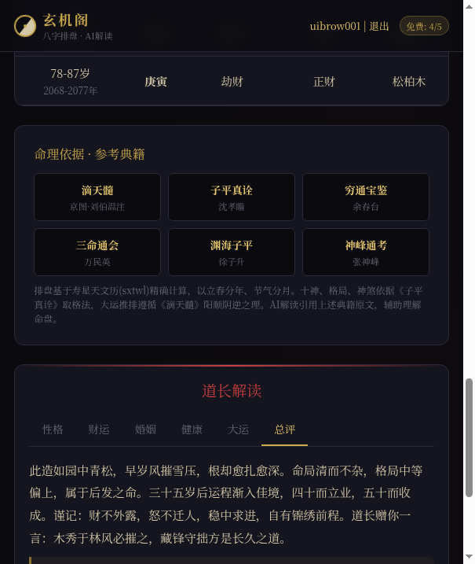

# 玄机阁 · AI 八字排盘 Demo

> 天文历法精确排盘 + DeepSeek 大模型流式解读的命理 Web 应用
> 一个"计算与生成分离"的 AI First 小型全栈 Demo

**在线 Demo**：http://129.204.102.108:8888


## 功能特性

- **精确排盘**：基于寿星天文历（sxtwl），公历转农历、节气换月令精确到分钟，四柱/十神/五行/神煞/大运全量计算
- **AI 流式解读**：DeepSeek 逐字流式输出（SSE），道长人设绘声绘色，每段解读附《滴天髓》《子平真诠》等古籍原文引用
- **账号体系**：注册/登录，新用户 5 次免费 AI 解读；同一命盘二次查看走缓存，**永远不重复扣费**
- **历史记录**：按账号隔离，访客排过的盘在注册后自动迁移到账号名下
- **成本可控**：单次解读 API 成本约 ¥0.001，缓存命中为 ¥0
- **零依赖部署**：SQLite 单文件数据库，Docker Compose 一条命令上线



---

## 1. 架构说明

### 1.1 总体架构

```
┌─────────────────────────────────────────────────────┐
│              前端（单页 · 内嵌于 app.py）              │
│   道教古典风 UI · fetch 读取 SSE 流 · 响应式布局       │
└──────────────────────┬──────────────────────────────┘
                       │ HTTP / SSE
┌──────────────────────▼──────────────────────────────┐
│                 API 层（Flask + Gunicorn/gevent）     │
│  /api/paipan     排盘（纯本地计算，不消耗配额）        │
│  /api/interpret  AI 解读（SSE 流式，消耗配额）         │
│  /api/register   /api/login   /api/logout  账号体系   │
│  /api/quota      /api/me     配额与会话查询           │
│  /api/history    /api/history/<id>   历史记录         │
│  /health         /api/stats  健康检查与统计            │
└───────┬────────────────────────┬─────────────────────┘
        │                        │
┌───────▼────────┐    ┌──────────▼─────────────────────┐
│   引擎层        │    │            服务层               │
│ bazi_engine.py │    │ db.py（SQLite）                 │
│ · 公历→农历     │    │ · 账号/会话/配额（5次免费）      │
│ · 四柱/十神     │    │ · AI 结果缓存（账号维度隔离）    │
│ · 五行/神煞     │    │ · 历史记录与迁移                │
│ · 大运/起运     │    │ ai_service.py                  │
│ (sxtwl 天文历)  │    │ · DeepSeek 流式调用             │
└────────────────┘    │ · Prompt 构建 / 成本核算        │
                      └──────────┬─────────────────────┘
                                 │ HTTPS (stream=true)
                          ┌──────▼──────┐
                          │ DeepSeek API │
                          │ deepseek-chat│
                          └─────────────┘
```

### 1.2 文件结构

| 文件 | 职责 |
|------|------|
| `app.py` | 主入口：Flask 路由 + 内嵌前端页面（HTML/CSS/JS 单文件交付） |
| `bazi_engine.py` | 八字排盘核心算法：历法转换、四柱、十神、格局、大运、神煞 |
| `db.py` | SQLite 数据层：账号、会话、配额、缓存、历史、用量日志 |
| `ai_service.py` | AI 服务层：Prompt 构建、DeepSeek 流式调用、缓存、成本计算 |
| `Dockerfile` | 生产镜像（gunicorn + gevent，支持 SSE 长连接） |
| `docker-compose.yml` | 一键部署 + 数据卷持久化 + 健康检查 |

### 1.3 两条核心链路

**排盘链路（免费、无 AI）**

```
用户提交生辰 → 参数校验（含真实日期校验，如 2月30日拒绝）
→ bazi_engine.paipan() 本地确定性计算
→ 结果落库（history 表）→ 返回 JSON
```

**AI 解读链路（消耗配额、SSE 流式）**

```
用户点击"请道长开示" → 校验登录态
→ 查缓存（cache_key = 账号指纹:MD5(生辰+性别)）
   ├─ 命中 → 直接流式回放，0 成本 0 配额
   └─ 未命中 → 校验配额 → DeepSeek 流式调用
      → 逐 chunk yield 给前端 → 完成后落缓存
      → 标记历史"已解读" → 扣配额（AI 失败则不扣）
```

### 1.4 设计原则：计算与生成分离

八字排盘是**确定性计算**（天文历法 + 固定规则），交由本地引擎完成；
AI 只负责**非确定性的表达**（解读、比喻、古籍引用）。
排盘数据以结构化文本喂给模型，从根本上避免大模型算错历法、编造四柱的幻觉问题。

---

## 2. 关键 Prompt 与 Vibe 思路

### 2.1 System Prompt（现行版本）

```
你是玄机阁的老道长，自幼出家研习命理五十载，精通《滴天髓》《子平真诠》《穷通宝鉴》
《三命通会》《渊海子平》《神峰通考》《命理约言》《李虚中命书》等命理经典，阅盘无数。
你解读命盘绘声绘色、有血有肉：善用意象比喻（如"命如春木逢甘霖，自有一番生机"
"财星深藏库中，似灯下藏金，须点灯方见"），像说书人一样娓娓道来，
让善信读来如临其境、如见其人；术语随讲随用大白话点破，不堆砌名词，不说车轱辘话。

分析原则：
1. 身旺者喜克泄耗（官杀/食伤/财星），忌生扶（印星/比劫）
2. 身弱者喜生扶（印星/比劫），忌克泄耗
3. 偏财格主意外之财、经商之财，正财格主固定工资之财
4. 七杀为用主魄力竞争，七杀为忌主灾祸压力
5. 日支为配偶宫，看日支十神和冲合判断婚姻
6. 五行偏旺者该五行对应脏腑需注意健康
7. 大运看天干地支十神，与日主生克关系定吉凶

文风要求：
1. 每个板块开头先用一两句有画面感的总起，先立意象再拆解命理
2. 讲吉凶要具体生动……避免"财运不错""婚姻和谐"这类空话
3. 该提醒的地方要直言不讳，该宽慰的地方也要给善信留有盼头
4. 总评结尾以道长口吻赠善信一句箴言收束全篇

格式要求：
1. 不要使用任何markdown格式
2. 每个板块用【】标记开头，如【性格】【财运】【婚姻】【健康】【大运】【总评】
3. 每方面解读末尾用"——"引出所依据的古籍原文，每方面至少引用2-3部不同古籍
4. 板块内直接写内容，换行分段即可
5. 每方面5-8句话深入分析加2-3句古籍引用，总字数控制在2000-3500字
```

**设计要点：**

| 设计 | 目的 |
|------|------|
| 老道长人设 + "五十载" | 匹配产品调性，输出自带统一口吻 |
| 意象比喻示例（few-shot） | 直接给定"绘声绘色"的锚点，比抽象要求有效得多 |
| 分析原则 7 条硬规则 | 命理学派共识写死在 prompt，防止模型自由发挥出矛盾结论 |
| 禁 markdown + 【】分板块 | 输出可直接按板块切 Tab 展示，前端零解析成本 |
| "——古籍云：…"固定格式 | 前端用正则识别引用行，渲染成金色引用块 + 汇总"引据典籍" |
| 字数区间 2000-3500 | 控制 output token 在 4000 上限内，成本可预估 |

### 2.2 User Prompt（结构化喂料 + 当前大运标记）

排盘结果压缩成高密度结构化文本，并注入两个关键上下文：

```
排盘数据：
日主：甲(木)
格局：偏印格
身弱
四柱：甲申 | 丙寅 | 甲午 | 庚午
十神：比肩 | 食神 | 日主 | 七杀
日支十神：伤官
五行：金2 木3 水0 火3 土0
喜用：水,木
忌神：金,火
神煞：驿马(寅), 华盖(午), 天乙贵人(申)
地支：寅申冲, 寅午半合
大运：
7-16岁 庚午(七杀/伤官) 2011-2020
17-26岁 辛未(正官/伤官) 2021-2030 ← 当前大运
27-36岁 壬申(偏印/七杀) 2031-2040
...
当前年龄：22岁（2026年）
```

- **`← 当前大运` 标记 + 当前年龄**：解决早期版本"AI 把 38-47 岁大运当成当下"的问题——模型不知道"现在"是哪年，必须显式告知
- **用 `|` 分隔、去掉字段名冗余**：同样信息比 JSON 喂法省约 40% input token

### 2.3 Vibe 思路（AI 辅助开发实录）

本项目由 AI 结对开发完成，典型的一次 Vibe 迭代循环：

```
用户自然语言反馈 → 定位问题根因（读代码而非猜）
→ 修复 + 补测试 → 回归全量测试 → 浏览器端到端验证 → 部署上线
```

几个有代表性的 Vibe 时刻：

1. **"大运显示 38-47 岁，可我才 22 岁"** —— 根因不是排盘算法错，而是模型不知道当前年份。修复方式不是改代码，而是给 prompt 注入"当前年龄 + 当前大运标记"，让模型自己认对时间轴
2. **"配额形同虚设，没登录也能排盘"** —— 拆成两个决策：排盘保持免费（引流），AI 解读强制登录（配额才有意义）；顺手发现缓存按全局生辰命中导致"别人算过的盘你不扣费"的隔离漏洞，改为**账号维度 cache_key**
3. **"来源不要写缓存命中，换成古籍"** —— 产品细节即品牌：技术上仍是缓存回放，但用户视角看到的应是"引据典籍：《滴天髓》《子平真诠》…"，前端从解读文本中实时提取实际引用的书名
4. **"算命结果绘声绘色一点"** —— 抽象需求翻译成可执行的 prompt 工程：人设升级 + 意象比喻 few-shot + "禁空话"负面清单 + 印章落款等视觉氛围配合

> Vibe 的核心不是"让 AI 随便写"，而是**把模糊的体感需求翻译成精确的约束**，再用测试闭环保证不回归。本项目最终由 64 项 API 测试 + 13 项前端渲染单测 + 浏览器端到端测试护航。

---

## 3. AI 调用逻辑

### 3.1 为什么不用 Function Calling

本项目的刻意设计：**排盘引擎负责"算"，大模型负责"说"**。

| 方案 | 问题 |
|------|------|
| 让 LLM 通过 function calling 现算四柱/节气 | 历法换算是确定性计算，LLM 必然算错（节气精确到分钟），且多轮工具调用延迟高、token 翻倍 |
| 本地引擎算好 → 结构化文本喂给 LLM 解读（本项目） | 一次调用、零幻觉、延迟可控，模型专注擅长的人文表达 |

排盘数据只读不写，天然适合"预计算 + 单轮生成"模式，无需工具调用协议。

### 3.2 流式输出全链路（SSE）

**后端**：DeepSeek `stream=true` → Flask generator 逐 chunk 转发：

```python
def generate():
    buffer = ''
    for chunk in deepseek_stream:          # requests.iter_lines()
        delta = chunk['choices'][0]['delta'].get('content', '')
        if delta:
            yield f"data: {json.dumps({'text': delta}, ensure_ascii=False)}\n\n"
    # 结束事件携带 token 用量与成本
    yield f"data: {json.dumps({'done': True, 'total_tokens': usage.total_tokens,
                               'cost_usd': cost})}\n\n"

return Response(generate(), mimetype='text/event-stream',
                headers={'X-Accel-Buffering': 'no'})   # 关键：禁用 Nginx 缓冲
```

**前端**：`fetch` + `ReadableStream` 逐字渲染，支持按【板块】自动切 Tab：

```javascript
const reader = response.body.getReader();
const decoder = new TextDecoder();
let buffer = '';
while (true) {
    const {done, value} = await reader.read();
    if (done) break;
    buffer += decoder.decode(value, {stream: true});
    const lines = buffer.split('\n');
    buffer = lines.pop();                  // 半截行留到下一轮
    for (const line of lines) {
        if (!line.startsWith('data: ')) continue;
        const chunk = JSON.parse(line.slice(6));
        fullText += chunk.text;
        renderTabs(fullText);              // 按【性格】【财运】…切分到各 Tab
    }
}
```

**流式渲染细节**：解读中的 `——滴天髓云：…` 引用行在前端实时识别（含流式半截书名的前缀匹配），渲染为金色古籍引用块；全部完成后落红色"玄机阁印"印章。

### 3.3 缓存与配额（成本核心）

```
cache_key = SHA256(账号指纹)[:32] + ':' + MD5(生辰+性别)
```

| 规则 | 说明 |
|------|------|
| 缓存按账号隔离 | 同一八字，A 账号算过不影响 B 账号的配额（防白嫖漏洞） |
| 缓存回放不扣配额 | 配额用完（0/5）后，算过的盘仍可永久免费回看 |
| AI 调用失败不扣配额 | 配额在流式成功结束后才落库，失败路径零消耗 |
| 新用户 5 次免费 | 注册即得，配额状态实时显示在顶部徽章 |

### 3.4 成本控制实测

| 策略 | 实测效果 |
|------|----------|
| deepseek-chat（非 reasoner） | 便宜模型足够胜任风格化写作 |
| 结构化精简 prompt | input ~1200 token/次 |
| max_tokens=4000 + 字数区间约束 | output ~2500 token/次 |
| 结果缓存 | 二次查看成本 ¥0 |
| **实测单次全成本** | **约 $0.0004（¥0.003）**，缓存命中 ¥0 |

---

## 4. 部署步骤（含 DNS / HTTPS）

### 4.1 前置条件

- 一台公网服务器（2核2G 起步即可，本项目在 2G 内存 CVM 上运行）
- 已安装 Docker 与 Docker Compose
- 一个 DeepSeek API Key（[platform.deepseek.com](https://platform.deepseek.com) 注册获取）
- 一个域名（用于 HTTPS，可选）

### 4.2 Docker Compose 部署（推荐）

```bash
# 1. 克隆仓库
git clone https://github.com/867008429-sudo/--AI-.git xuanjige
cd xuanjige

# 2. 配置环境变量
cp .env.example .env
vi .env
# 填入 DEEPSEEK_API_KEY=sk-xxxxxxxx

# 3. 启动（首次会自动构建镜像）
docker compose up -d

# 4. 查看日志 / 验证
docker compose logs -f
curl http://127.0.0.1:8888/health
# {"status":"ok","ai_enabled":true}

# 更新代码后
git pull && docker compose up -d --build
```

数据库通过 `db-data` 卷持久化，重建容器数据不丢。

### 4.3 DNS 配置

到域名服务商（腾讯云 DNSPod / 阿里云 / Cloudflare 等）添加解析记录：

| 记录类型 | 主机记录 | 记录值 | 说明 |
|----------|----------|--------|------|
| A | `@` | `129.204.102.108` | 根域名 → 服务器 IP |
| A | `www` | `129.204.102.108` | www 子域 |
| A | `sm` | `129.204.102.108` | （可选）子域名，如 sm.yourdomain.com |

生效后 `ping your-domain.com` 返回服务器 IP 即解析成功。

### 4.4 HTTPS（Nginx + Let's Encrypt 免费证书）

**安装并申请证书：**

```bash
sudo apt install nginx certbot python3-certbot-nginx

# 先把 Nginx 起起来（80端口能访问），再签发证书
sudo certbot --nginx -d your-domain.com -d www.your-domain.com
# certbot 会自动改写 Nginx 配置并配置自动续期
```

**Nginx 站点配置（`/etc/nginx/sites-available/xuanjige`）：**

```nginx
server {
    listen 80;
    server_name your-domain.com;
    return 301 https://$host$request_uri;      # HTTP 全部跳转 HTTPS
}

server {
    listen 443 ssl;
    http2 on;
    server_name your-domain.com;

    ssl_certificate     /etc/letsencrypt/live/your-domain.com/fullchain.pem;
    ssl_certificate_key /etc/letsencrypt/live/your-domain.com/privkey.pem;

    location / {
        proxy_pass http://127.0.0.1:8888;
        proxy_set_header Host $host;
        proxy_set_header X-Real-IP $remote_addr;
        proxy_set_header X-Forwarded-For $proxy_add_x_forwarded_for;
        proxy_set_header X-Forwarded-Proto $scheme;

        # ↓↓↓ SSE 流式输出三件套（缺一不可）↓↓↓
        proxy_buffering off;          # 关闭响应缓冲，chunk 立即下发
        proxy_cache off;
        proxy_read_timeout 120s;      # 长连接超时要大于最长生成时间
    }
}
```

```bash
sudo ln -s /etc/nginx/sites-available/xuanjige /etc/nginx/sites-enabled/
sudo nginx -t && sudo systemctl reload nginx
```

**证书自动续期**（certbot 通常已自带 systemd timer，验证一下）：

```bash
sudo certbot renew --dry-run
```

> 没有域名也能跑：直接用 `http://服务器IP:8888` 访问（即当前 Demo 的形态）。
> 云服务器需在安全组放行 80/443/8888 端口。

### 4.5 更新与回滚

```bash
# 代码热更新（compose 里代码文件是卷挂载，重启即生效）
git pull && docker compose restart

# 回滚到上一个版本
git reset --hard HEAD~1 && docker compose restart
```

### 4.6 安全清单

- `.env`（API Key）已在 `.gitignore` 中，**切勿提交到仓库**
- 数据库文件 `*.db` 不入库，生产数据在 Docker 卷 `db-data` 中
- `FLASK_DEBUG=0`（生产默认）
- 建议上 HTTPS 后再对外开放注册，登录态走 HttpOnly Cookie + Bearer Token 双通道

---

## API 一览

| 端点 | 方法 | 说明 | 消耗配额 |
|------|------|------|----------|
| `/api/paipan` | POST | 八字排盘（含日期合法性校验） | 否 |
| `/api/interpret` | POST | AI 流式解读（SSE，未登录 401） | 是（缓存/失败除外） |
| `/api/register` `/api/login` `/api/logout` | POST | 账号体系 | 否 |
| `/api/quota` `/api/me` | GET | 配额 / 会话查询 | 否 |
| `/api/history` `/api/history/<id>` | GET/DELETE | 历史记录（账号隔离） | 否 |
| `/health` `/api/stats` | GET | 健康检查 / 用量统计 | 否 |

## 技术栈

| 层 | 技术 | 选型理由 |
|----|------|----------|
| 前端 | HTML/CSS/JS（单文件内嵌） | Demo 级零构建，古典风 Noto Serif SC |
| 后端 | Flask 3 + Gunicorn(gevent) | gevent 协程支撑 SSE 长连接 |
| 排盘 | sxtwl（寿星天文历） | 节气级精确，业界排盘软件同源历法 |
| AI | DeepSeek chat completions | 便宜、中文风格化写作能力强 |
| 数据 | SQLite | 单文件零运维，Demo 场景最优解 |
| 部署 | Docker Compose | 一条命令，健康检查自愈 |

## License

MIT
